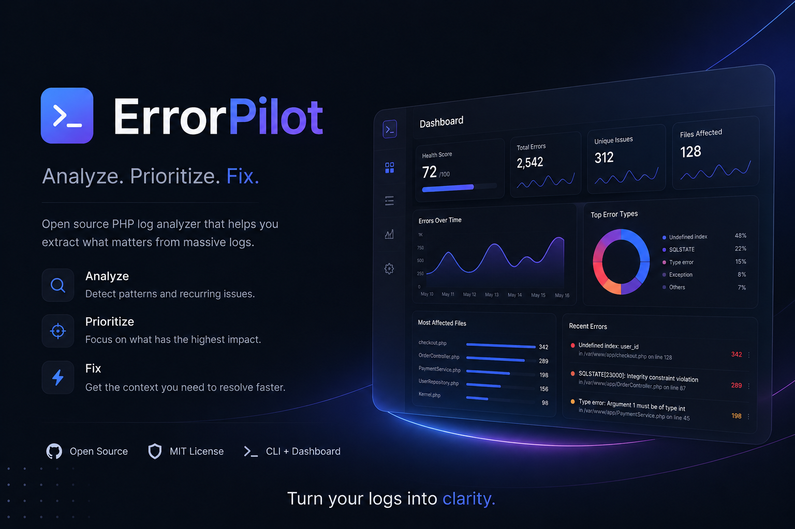

# ErrorPilot

### Analyze. Prioritize. Fix.

Open Source PHP Log Analyzer & Interactive Error Diagnostics Dashboard.

 

  

---

## Why ErrorPilot?

Instead of reading **200,000 log lines**...

ErrorPilot automatically:

- Groups duplicated errors
- Prioritizes issues
- Finds the most problematic files
- Generates an interactive dashboard
- Helps you fix the right problems first